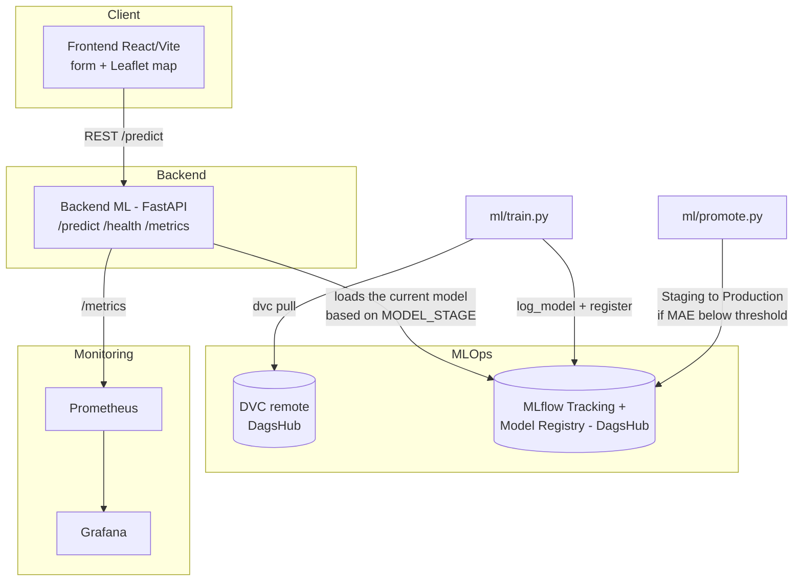

# DVF Paris - Apartment Price Estimation (MLOps Project)

Web application serving a machine learning model that estimates apartment prices in Paris (using the [DVF](https://www.data.gouv.fr/) dataset, "Demandes de Valeurs Foncieres"), built around a full MLOps lifecycle: data versioning (DVC), model tracking and registry (MLflow/DagsHub), 4-branch CI/CD with quality gates, cloud deployment (Render) and monitoring (Prometheus/Grafana).

## Team
- Soave Raphael
- Clement Malo
- Garnier Tristan

## Public URLs

| Environment | Frontend | Backend (API) |
|---|---|---|
| Staging | https://dvf-frontend-staging.onrender.com | https://dvf-backend-staging.onrender.com |
| Production | https://dvf-frontend-production.onrender.com | https://dvf-backend-production.onrender.com |

GitHub repo: https://github.com/Demonta0109/DevOps-MLOps-Project

MLflow tracking / DVC remote: https://dagshub.com/tristan.garnier1090/DevOps-MLOps-Project

---

## Architecture



The backend never serves a hardcoded model: on startup it queries the MLflow Model Registry and loads the version currently at the `Staging` or `Production` stage, depending on the `MODEL_STAGE` environment variable. This guarantees that production only ever serves models that have been explicitly promoted.


## Reproducibility

### Prerequisites
Docker Desktop, Python 3.11+, Node 20+, a DagsHub account with access to the repo.

### Steps

```bash
git clone https://github.com/Demonta0109/DevOps-MLOps-Project.git
cd DevOps-MLOps-Project

# Configure credentials (see .env.example)
cp .env.example .env
# Fill in DAGSHUB_USERNAME / DAGSHUB_TOKEN, DATABASE_URL (Supabase) and JWT_SECRET in .env

# Pull the data versioned by DVC
pip install dvc
dvc remote modify origin --local auth basic
dvc remote modify origin --local user <your_dagshub_username>
dvc remote modify origin --local password <your_dagshub_token>
dvc pull data/raw/dvf.csv.dvc

# Start the full stack (backend + frontend)
docker compose up --build
```

- Frontend: http://localhost:5173
- Backend Main (Node.js, API entry point): http://localhost:4000
- Backend ML (FastAPI, internal): http://localhost:8000 (interactive docs at `/docs`)

### Authenticating locally (before Google login is wired in)

`backend-main`'s routes under `/api/v1/*` require a JWT. Until Google OAuth is implemented, get a development token:

```bash
curl -X POST http://localhost:4000/auth/dev-token
```

Then, in the browser console on the frontend:

```js
localStorage.setItem("authToken", "<token from above>");
```

Reload the page: requests to `/api/v1/estimate` will now carry the token. This route returns `404` when `NODE_ENV=production`.

### Training a model locally

```bash
cd ml
python -m venv venv && source venv/Scripts/activate   # or venv/bin/activate on Linux/Mac
pip install -r requirements.txt
python train.py --raw-data ../data/raw/dvf.csv --processed-data ../data/processed/dvf_paris_clean.csv --dvc-file ../data/raw/dvf.csv.dvc
```
This trains a `RandomForestRegressor`, registers it in the MLflow Model Registry (`dvf-paris-price`), and automatically moves it to the `Staging` stage.

### Running the tests

```bash
pip install -r backend-ml/requirements.txt -r ml/requirements.txt -r tests/requirements.txt
pytest          
pytest -m ""    
```

---

## MLOps cycle: data, model, promotion

### Data (DVC)
The raw DVF dataset (Paris apartment sales) is versioned with DVC; the corresponding `.dvc` file is committed to Git, so every training run can be traced back to an exact data version.

`ml/prepare.py` filters (`nature_mutation == "Vente"`, `type_local == "Appartement"`, `code_departement == "75"`), de-duplicates multi-lot sales (aggregated by `id_mutation`), and cleans outliers (price, surface).

### Model & Registry (MLflow)
`ml/train.py`:
1. Loads and prepares the data
2. Trains an sklearn pipeline (`StandardScaler` + `OneHotEncoder` + `RandomForestRegressor`)
3. Logs to MLflow: parameters, metrics (MAE/RMSE/R2), and two required tags, the current Git commit hash and the DVC data version (md5 hash of the `.dvc` file), for full data + code traceability
4. Registers the model in the Model Registry under the name `dvf-paris-price` and moves it to the `Staging` stage

### Promotion (Staging to Production)
`ml/promote.py` implements the accuracy quality gate: it fetches the current `Staging` candidate, compares its MAE against a threshold (150,000 EUR), and:
- **if the MAE is below the threshold**, promotes the version to `Production` (archiving the previous Production version)
- **otherwise**, does nothing: the model stays in `Staging` and production is left untouched

---

## CI/CD (GitHub Actions)

The repo uses 4 branches: `feature/*` to `dev` to `staging` to `main`, each with its own branch protection rules and workflow.

### 1. `ci-dev.yml`: PR to `dev`
Triggered on every pull request targeting `dev`:
1. Unit + integration tests (`pytest`)
2. Build the backend and frontend Docker images (no push): validates that the Dockerfiles build correctly

### 2. `cd-staging.yml`: push to `staging`
Triggered on merge into `staging`:
1. **Full test suite** (unit + integration + e2e, the latter spinning up a real docker-compose stack)
2. **Training** of the candidate model + registration in MLflow (`Staging` stage)
3. **Deployment** of the code to the staging environment (Render, via a Deploy Hook)
4. **Quality gates**:
   - *Gate 2 (smoke test)*: build the candidate image, `/predict` must respond `200` with a price `> 0` in under 2 seconds
   - *Gate 1 (MAE)*: `ml/promote.py`, 

    if both gates pass, the model is promoted to `Production`
5. If a gate fails, the promotion step is never reached: the model stays in `Staging` and production is left untouched

### 3. `cd-prod.yml`: push to `main`
Triggered on merge into `main`. Checks that a model is present at the `Production` stage in the registry (`ml/check_production_model.py`), then deploys the same code to the production environment.

### Secrets
Each GitHub environment (`staging`, `production`) has its own secrets: `MLFLOW_TRACKING_URI`, `DAGSHUB_USERNAME`, `DAGSHUB_TOKEN`, and the Render Deploy Hooks (`RENDER_BACKEND_*_DEPLOY_HOOK`, `RENDER_FRONTEND_*_DEPLOY_HOOK`). No secret is hardcoded anywhere; configuration is entirely driven by environment variables (see `backend-ml/app/config.py`).

---

## Deployment (Render.com)

4 Docker services, Auto-Deploy disabled: **only the GitHub Actions workflows trigger a deployment**, through the Render Deploy Hooks, never automatically on a plain push.

| Service | Branch | MLflow stage served |
|---|---|---|
| `dvf-backend-staging` | `staging` | `Staging` |
| `dvf-backend-production` | `main` | `Production` |
| `dvf-frontend-staging` | `staging` | n/a |
| `dvf-frontend-production` | `main` | n/a |

---

## Monitoring (Prometheus + Grafana)

The backend exposes `/metrics` (Prometheus format): `prediction_requests_total`, `prediction_latency_seconds` (histogram), `prediction_failures_total`, `model_loaded` (model status), plus the standard HTTP metrics.

### Local option (recommended for development/testing)
```bash
docker compose up -d --build
```
- Grafana: http://localhost:3000 (login `admin` / `admin`), the **"DVF Paris - Backend ML (Local)"** dashboard is provisioned automatically (4 panels: request volume, p50/p95 latency, error rate, health status)
- Prometheus: http://localhost:9090

To monitor real production from this local Prometheus instead of the local backend, point the config at `monitoring/grafana-prod/prometheus-production.yml` (targets `dvf-backend-production.onrender.com` over HTTPS).

### Grafana Cloud option

- Staging : [DVF Paris - Backend ML (Staging)](https://shortsouffle2105.grafana.net/public-dashboards/b536692f1ebf4842aa99637b6ce6566e)

- Production : [DVF Paris - Backend ML (Production)](https://shortsouffle2105.grafana.net/public-dashboards/b32c37bf090448349361eecfaafdd32b)